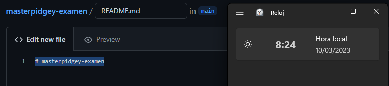

# masterpidgey-examen

## Creacion del repositorio

>Para crear el repositorio iremos al apartado "repository" en github y alli le daremos a "New".

  

> una vez hecho esto tendremos una nueva ventana donde podremos poner el nombre del repositorio y crearlo.

***

##  README.md
> Para crear el README.md en la ventana que nos sale le damos clic a README en la linea de texto que tenemos donde nos pide que añadamos un documento o creemos uno nuevo.  
Desde alli ya nos creará el README con el titulo incluido.

***

## Clonacion del repositorio
> En el repositorio de gitub deberemos sacar la direccion local del repositorio.

> Para clonar el repositorio en el directorio de nuestro equipo primero debemos abrir Git bash y una vez situados en la carpeta que queremos realizamos un git init.

> Despues pondremos el siguiente comando para clonar el repositorio.

***

## Commit inicial

> Para el comit inicial debemos añadir el siguiente comando.

***

## Push inicial

> Para el push inicial pondremos el siguiente comando.

***
## Ignorar archivos

> Para  ignorar archivos lo primero que haremos sera crear un archivo y un directorio que ignorar, en este caso, sera el archivo "Privado.txt" y la carpeta "Privada".

> Despues crearemos el archivo .gitignore y en el añadiremos lo que queremos ocultar.

> haremos un push para gaurdar los cambios en github.
***

## Añadir fichero

> Para este apartado crearemos el archivo 1.txt.

> Despues añadiremos y subiremos los cambios.

***
## Ver los commits realizados hasta ahora

> para ello pondremos el comando git log y nos tendria que salir una respuesta similar a esta.

***

## Creación de un tag
> Para crear un tag tendremos que poner el siguiente comando.

> Esto que se nos ha abierto es el editor de texto vim que es un poco complicado de entender, tenemos que poner un comentario y guardarlo para crear el tag.

> A continuacion añadiremos y subiremos los cambios al repositorio.
